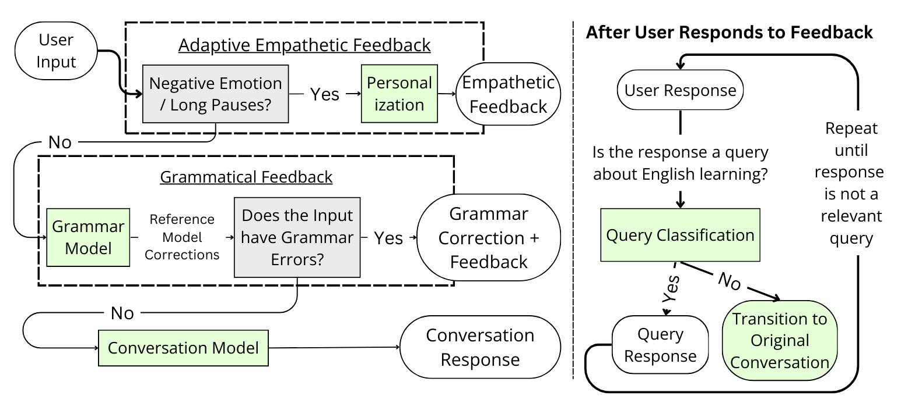

# EDEN: Empathetic Dialogues for English learning

This is the code for our paper **EDEN: Empathetic Dialogues for English learning**.

Our paper improves upon our previous work, [Using Adaptive Empathetic Responses for Teaching English](https://arxiv.org/abs/2404.13764). We detail our specific improvements in the following figure, where our improvements are highlighted in green:

### Repository Structure
Our repository is organized as the following:

1. `eden_api/`: The API for EDEN for you to run on your own GPU server. Since the grammar correction code is proprietary, we do not include the grammar correction component in this repository. Instead, you can check out the `grammar_model` repository for how we trained our grammar model.
2. `local_ui/`: A barebone UI for using EDEN locally! It is a streaming chatbot UI that you can adopt for your own purposes as well!
3. `dialogue_model/`: Code and data for training our LLama-2 conversation model.
4. `grammar_model/`: Data for training our Llama-2 spoken grammar correction model (under construction).
5. `experimental_data/`: Data from our user study. Specifically, we include the informed consent form, as well as the data we used for analyses, for reproduction purposes. 